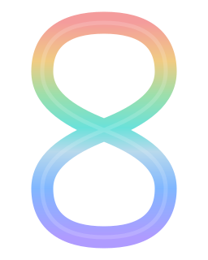
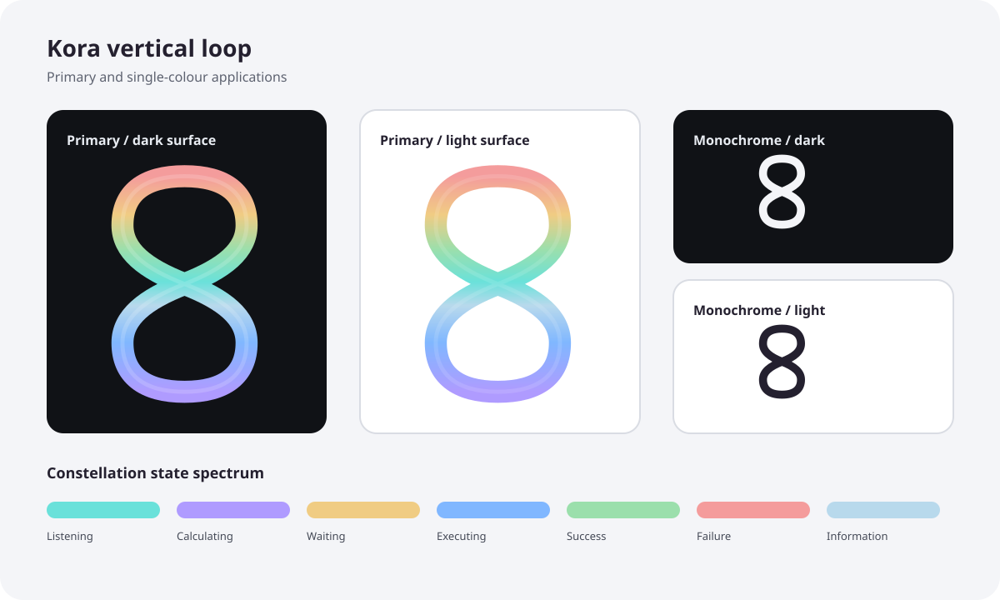
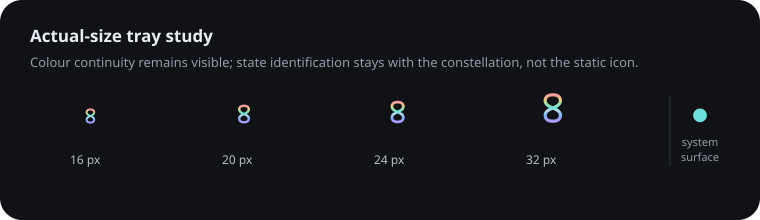

# Kora Branding

Status: proposed visual identity direction. The primary mark is approved as a
design concept but has not yet replaced application or repository artwork.

The Kora mark is a free-standing vertical infinity loop. Its geometry sits
between a conventional rounded infinity symbol and a square-sided hourglass:
the lobes are softly squared, the crossover is narrow, and the stroke remains
one continuous ribbon.

## Primary mark



The continuous gradient uses the same colours as the assistant states. It
represents Kora moving through different modes of attention and feedback while
remaining one assistant. It is not a rainbow decoration and must not be
recoloured with an unrelated spectrum.

## Surface and monochrome samples



- Use the multicolour mark for the application, executable, repository, social,
  and website identity whenever the surface can reproduce the gradient clearly.
- The mark remains free-standing. The dark and light rectangles above demonstrate
  host surfaces; they are not part of the logo.
- Use the monochrome mark for single-ink printing, masks, high-contrast modes,
  and environments that cannot preserve the gradient.
- Prefer near-white `#F4F5F8` on dark surfaces and ink `#24202F` on light surfaces.
- Do not put the primary mark inside a permanent rounded-square, circle, or shield.

## State palette

| State | Colour | Meaning in the presence |
|---|---|---|
| Listening | `#6AE1DA` | Voice input is active |
| Calculating | `#AF9BFF` | Kora is interpreting or planning |
| Waiting | `#F0CC83` | Kora needs time or user input |
| Executing | `#80B7FF` | An approved action is running |
| Success | `#9BDFAC` | The action completed |
| Failure | `#F49C9C` | The action failed or cannot continue |
| Information | `#B8D9EC` | Neutral status or explanatory feedback |

The static brand mark contains the complete palette. Runtime state is still
communicated by the presence, text, and accessible status indicators; the
static icon must not be treated as a live state indicator.

## Animated web mark



The web variant moves the complete seven-colour suite around the ribbon itself,
rather than rotating a page-level gradient across the mark. Overlapping colour
samples follow the static mark's palette order and are blended inside a crisp
ribbon mask, avoiding visible segment boundaries while preserving path-following
motion. One circuit takes eight seconds and repeats at a constant speed so the
logo feels ambient rather than like a progress indicator.

- Animation is a progressive enhancement for websites and motion-capable digital
  surfaces. Do not use it for the executable, tray icon, favicon, print, or email.
- The SVG is self-contained and uses CSS only; it requires no JavaScript, network
  request, or animation library.
- It may be referenced from an `` element or embedded inline. Inline use is
  preferable when a site needs to control dimensions or coordinate its motion policy.
- The internal `prefers-reduced-motion: reduce` rule stops travel and leaves all
  seven colour bands visible in a static arrangement.
- Do not speed it up to imply activity. Application progress and runtime state
  continue to belong to the presence and accessible status surfaces.

## Small sizes



- Preserve the silhouette before preserving subtle gradient detail.
- At 16–24 px, use a raster asset drawn for that exact size rather than relying
  on Windows to reduce the large vector or executable icon.
- Keep the crossover open by at least one physical pixel.
- Do not add lettering, particles, outlines, or a container at tray sizes.
- A dynamic tray-state treatment may be explored separately, but it must not
  replace the operating system's accessible tooltip or menu state.

## Geometry and spacing

- Keep the mark upright; do not rotate it into a horizontal infinity symbol.
- Clear space on every side is at least half the ribbon width.
- Do not stretch the mark, alter only one lobe, widen the crossover, or break the
  ribbon into disconnected colour pieces.
- Use rounded stroke ends and joins. The lobe sides should feel controlled rather
  than circular, while avoiding sharp hourglass corners.

## Source assets

- [Primary scalable mark](Branding/Kora.Mark.Primary.svg)
- [Animated web mark](Branding/Kora.Mark.Animated.svg)
- [Surface and monochrome samples](Branding/Kora.Mark.Samples.svg)
- [Small-size study](Branding/Kora.Mark.SmallSizes.svg)

Raster tray assets, the Windows multi-resolution `.ico`, favicons, and social
preview artwork should be derived from this source after small-size rendering
has been reviewed on Windows light and dark taskbars.

The Windows executable, window, and system tray use
`src/Kora/Assets/Kora.ico`. Regenerate its native-size PNG frames after
an approved geometry or palette change:

```powershell
.\eng\Generate-WindowsIcon.ps1
```
